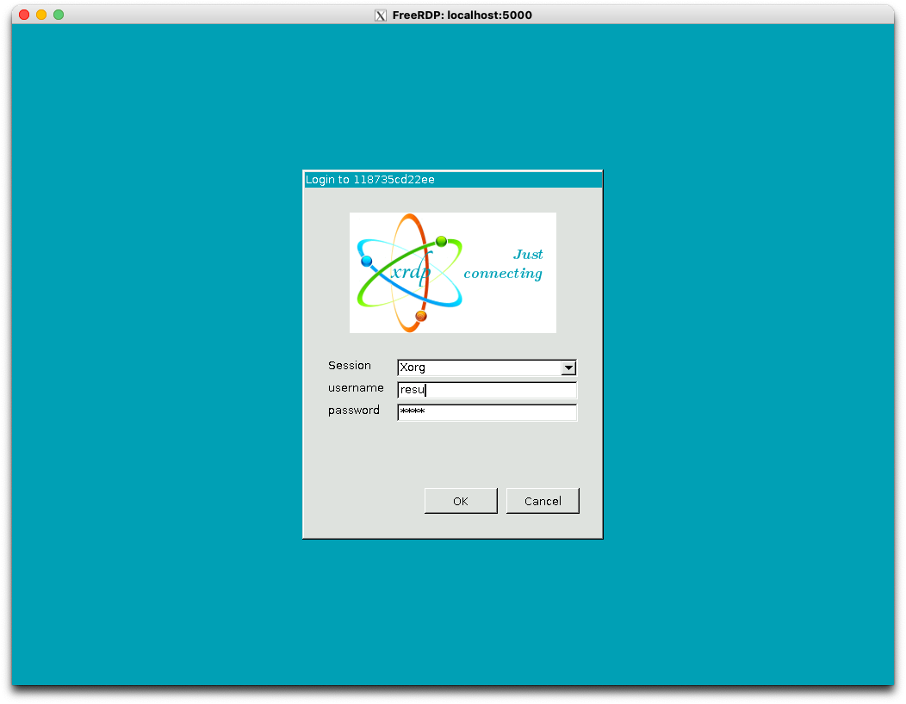
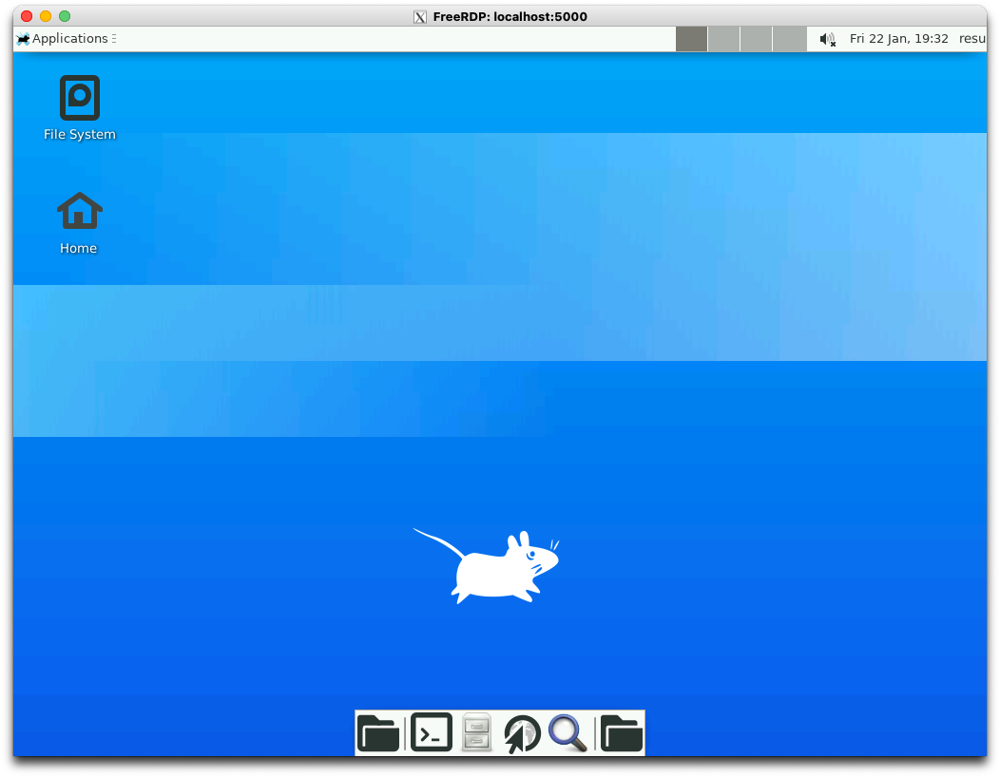

# xrdp-container

An example of a Docker container with xrdp access

## :rocket: How to use

First, build the image with `docker`:

```bash
docker build -t rdp_test .
```

Then, launch the container:

```bash
docker run -it -p 5000:3389 rdp_test
```

And use your favorite XRD client to connect, for example [FreeRDP](https://github.com/FreeRDP/FreeRDP/wiki/PreBuilds):

```bash
xfreerdp /v:localhost:5000
```

You should see something similar to the following screenshot:



You can use user name and password `resu:resu` to start the desktop session:



**NOTE**: the container was tested also using [Microsoft Remote Desktop](https://www.microsoft.com/en-us/p/microsoft-remote-desktop/9wzdncrfj3ps?activetab=pivot:overviewtab)

## :info: Container details

* The `supervisord` package is used to enable `dbus` and `xrdp` session manager to work correctly. In fact, they want that `dbus` is a child of the first process with **pid 0**. `supervisord` fulfills this and that's why it is also the **CMD** launched.
* `whoopsie` is useful just in `ubuntu` based distribution to enable error reports and, consequently, catch `dbus` errors.
* `dbus-x11` is required for a correct launch of the remote session by the `xrdp-sessman` that uses `dbus-launch`
